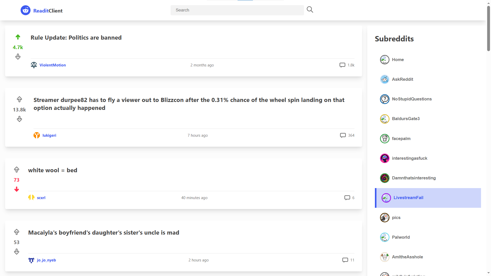

# Readit Client

A Reddit client built with React, TypeScript, Redux Toolkit, and Vite.

This app lets users browse subreddit posts, search posts by title, and read comment threads in a clean two-column layout.

### Layout



## Technologies Used

- React 19
- TypeScript 5
- Redux Toolkit + React Redux
- Vite
- Vitest + Testing Library + JSDOM
- ESLint
- react-icons
- react-loading-skeleton
- react-markdown
- moment

## Features

- Browse hot posts from selected subreddits.
- Fetch and display subreddit list in a dedicated sidebar panel.
- Search posts by title using a global Redux-managed search term.
- Expand and collapse comments per post.
- Render comment body markdown with react-markdown.
- Relative time formatting for posts and comments.
- Local post voting UI state (upvote/downvote toggle).
- Loading skeletons for posts and comments.
- Error states with retry actions for failed post and comment requests.

## Getting Started

### Prerequisites

- Node.js 18+
- npm 9+

### Install

```bash
npm install
```

### Run in Development

```bash
npm run dev
```

### Build

```bash
npm run build
```

### Lint

```bash
npm run lint
```

### Test

```bash
npm run test
```

## Project Structure

```text
src/
	api/            # Reddit API helpers
	components/     # Shared presentational components
	features/       # Feature-focused UI modules
	store/          # Redux store and slices
	utils/          # Utility functions
```

## Future Work

- Add pagination or infinite scrolling for post feeds.
- Add subreddit favorites and persistence (local storage).
- Add sorting controls (hot, new, top).
- Improve accessibility (keyboard navigation, focus states, ARIA refinements).
- Add robust image/media handling for non-image post types.
- Add integration tests for async Redux flows and key user journeys.
- Add error boundaries and improved offline/network feedback.
- Add dark mode and theme customization.

